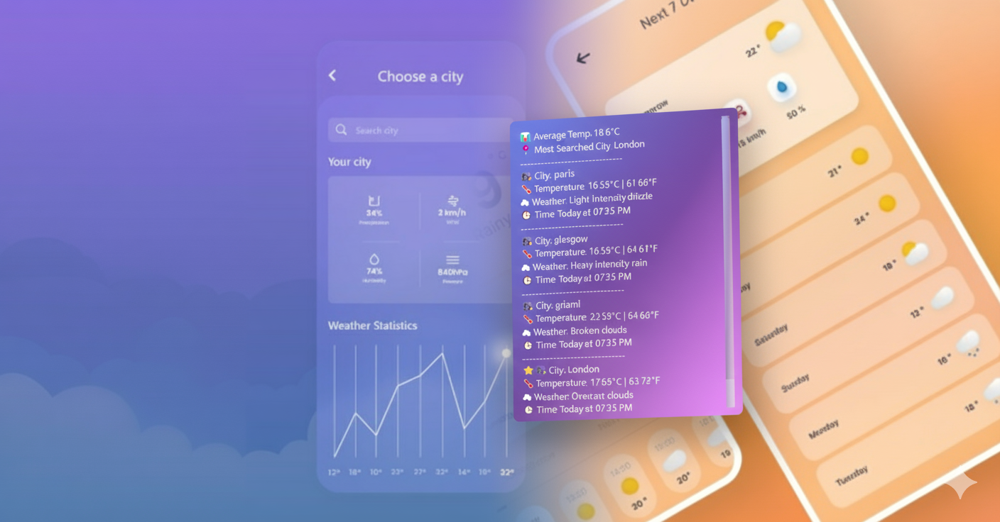

# Simple Weather App (PyQt5)
A simple Python GUI application that checks the current weather of any city using the **OpenWeatherMap API**.  

Built with **PyQt5** for the interface, **Requests** for API calls, **NumPy** for temperature conversion, and **Pandas** for weather history management.  
This project is part of my journey into building Python applications that combine **APIs**, **GUI development**, and **data handling**.

---

## Features
- Search weather by **city name**
- Displays temperature in **Celsius & Fahrenheit**
- Shows weather condition icons (☀️, 🌧, ❄️, 🌩,☁️, etc.)
- Provides a short weather **description**
- Simple and clean **PyQt5 GUI**

---

## Installation
Clone the repository and install dependencies:

```bash
git clone https://github.com/Gaurav-MLOps/Weather-App.git
cd Weather-App
pip install pyqt5 requests numpy pandas